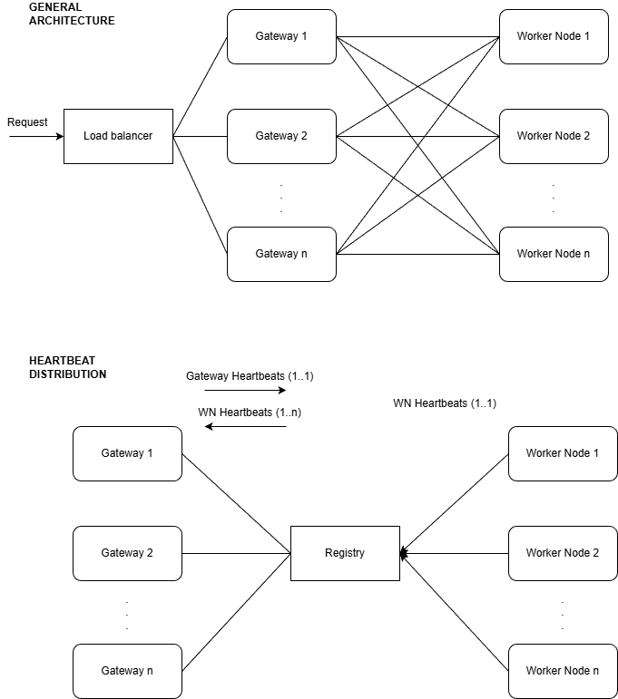
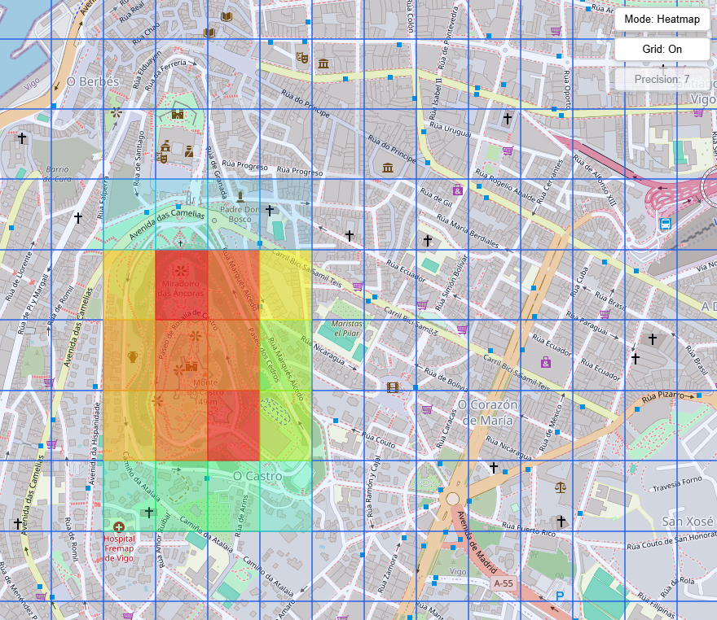
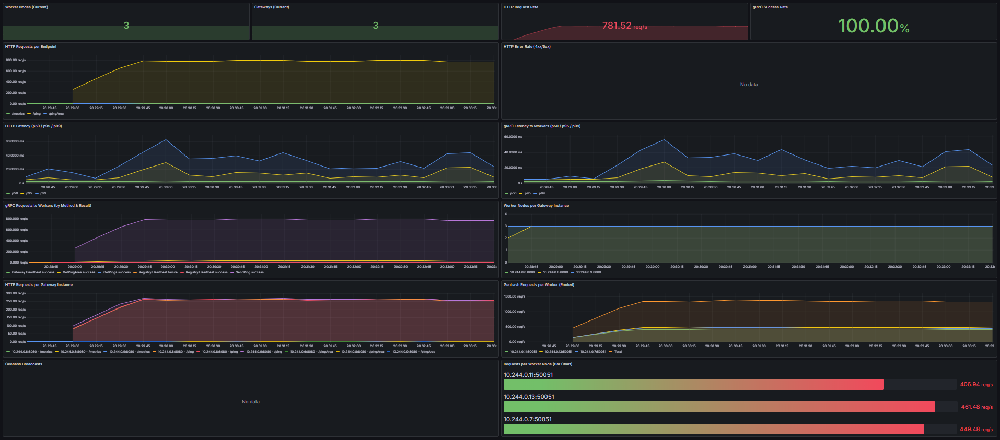
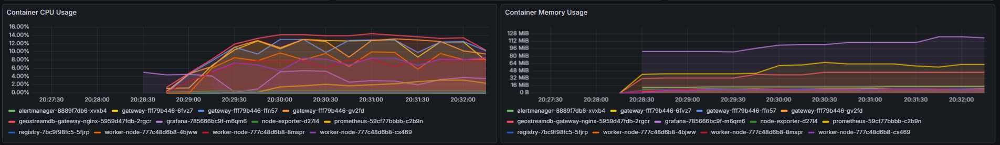

# GeoStreamDB

[](https://github.com/MrPoll0/geostreamdb/actions/workflows/tests.yml)

Distributed geospatial ping storage and query engine via a sharded architecture built with Go and Kubernetes (with a Docker Compose version).

A ping is a single point in space and time that lives for a fixed duration (TTL; currently 10 seconds). Pings can be stored by sending a HTTP request to the API with the location coordinates (lat/lng). They can also be queried by area, by sending a HTTP request to the API with a bounding box and a precision. The precision is the number of characters in the geohash prefix, which defines the granularity of the query.

GeoStreamDB is split into three core services:
- `gateway`: HTTP API (`/ping`, `/pingArea`) and request routing
- `worker-node`: shard storage/aggregation workers (gRPC)
- `registry`: service discovery and heartbeat coordination (gRPC)

The repo also includes observability and test tooling:
- Prometheus + Grafana + Alertmanager
- Kubernetes manifests
- Docker Compose local stack
- k6 test scenarios

## Architecture (high level)



### Ping ingestion flow (POST /ping)
0. Registry acts as a single point of truth for worker/gateway heartbeats for service discovery.
1. Client sends a HTTP request to the Load Balancer entrypoint (Docker Compose: `loadbalancer` nginx on `:8080`; Kubernetes: Gateway API via NGINX Gateway Fabric).
2. Load Balancer routes the request to a `gateway` replica.
3. Gateway maps the ping to a worker node via consistent hashing (a ring with virtual nodes). The sharding key is the first `SHARDING_PRECISION` characters of the geohash.
4. Gateway calls the selected worker node via gRPC (`SendPing`).
5. Worker node stores the ping in a 10s TTL time-buffer, where each time slot contains a Trie keyed by geohash prefixes (with a dense leaf optimization at `SHARDING_PRECISION` → `MAX_GH_PRECISION`) with the ping count as value.

### Area query flow (GET /pingArea)
1. Client sends a HTTP request to the Load Balancer entrypoint.
2. Load Balancer routes the request to a `gateway` replica.
3. Gateway computes a geohash cover set for the bounding box and chooses an aggregated precision to bound fanout.
4. Gateway either:
   - routes each covered geohash to its responsible worker(s) via gRPC (`GetPingArea`) when the aggregated precision is at/above the sharding precision, or
   - broadcasts the request to all workers (when the aggregated precision is below the sharding precision).
5. Worker nodes traverse their TTL time-buffer and aggregate counts from the Trie for the requested area (with bbox intersection filtering), then return results.

### Extras
- Prometheus scrapes metrics from all components.
- Grafana dashboards for monitoring and alerting.
- Alertmanager with Prometheus alerting rules.

## Repository layout

- `gateway/` - HTTP API and routing logic
- `worker-node/` - gRPC worker service
- `registry/` - gRPC registry/discovery service
- `proto/` - protobuf definitions
- `k8s/` - Kubernetes manifests (deployments, services, HPA, Gateway API)
- `overlays/` - Kustomize overlays (`minikube`, `prod`)
- `prometheus/` - Prometheus and Alertmanager configuration
- `grafana/` - dashboards and provisioning
- `test/` - test scripts and results. `run-tests.ps1` orchestrates tests.
- `loadbalancer/` - NGINX configuration for Docker Compose version

## Prerequisites

There are 2 versions for local development and testing:
- Docker + Docker Compose (default)
- Kubernetes + Minikube

## Quickstart (Docker Compose)

Start the stack:

```powershell
docker compose up --build -d
```

Default local endpoints:
- API entrypoint: `http://localhost:8080`
- Grafana: `http://localhost:3000`
- Prometheus: `http://localhost:9090`
- Alertmanager: `http://localhost:9093`
- Example web app: `index.html`



Stop:

```powershell
docker compose down
```

## Quickstart (Kubernetes via test runner)

Run a k6 scenario and bootstrap infra automatically:

```powershell
./test/run-tests.ps1 -UseKubernetes -Test sustained-load
```

This script uses:
- Minikube
- NGINX Gateway Fabric + Gateway API resources
- App and observability manifests
- Local port-forwards for API/Prometheus/Grafana/Alertmanager

## API (current)

Gateway HTTP endpoints:
- `POST /ping` with JSON body: `{ "lat": <float>, "lng": <float> }`
- `GET /ping?lat=<float>&lng=<float>`
- `GET /pingArea?minLat=...&maxLat=...&minLng=...&maxLng=...&precision=...`
- `GET /metrics`

## Observability and alerts

Prometheus alerting is configured with Alertmanager.

Current baseline alert rules include:
- target down (`up == 0`)
- high node CPU/memory
- high pod CPU/memory (namespace `geostreamdb`)
- Prometheus-to-Alertmanager disconnect

Local UIs:
- Prometheus: `http://localhost:9090`
- Alertmanager: `http://localhost:9093`
- Grafana: `http://localhost:3000`




## Running tests

Examples:

```powershell
# default (Docker Compose)
./test/run-tests.ps1 -Test sustained-load

# Kubernetes
./test/run-tests.ps1 -UseKubernetes -Test all-direct

# Orchestrated scenarios (includes known disruptive tests)
./test/run-tests.ps1 -UseKubernetes -Test all-orchestrated
```

Artifacts are written under `k6/outputs`.

## Notes

No open-source license has been granted at this time. All rights reserved.
